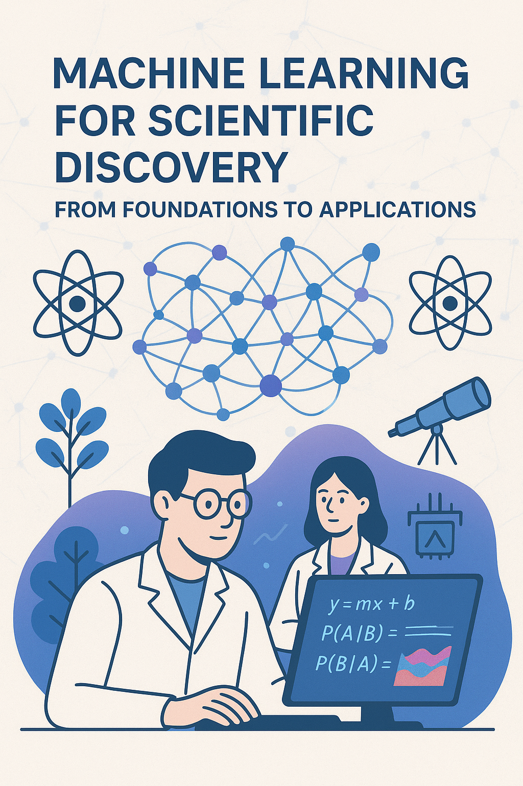

# ENS course: Machine Learning for Scientific Discovery: From Foundations to Applications (2026)

The 2026 edition is in preparation. The teaching materials below are carried over from 2025 and will be updated as the course is prepared.

The [2025 course archive](https://github.com/mlelarge/ens-ml4sd/tree/year-2025) contains the previous edition, including its schedule and practical solutions.

Marc Lelarge and Tony Bonnaire with Julien Moreau

 Image created with ChatGPT.

This course introduces the foundations of machine learning, from statistical models to modern deep learning, with a focus on practical applications in scientific research. Students will learn core methods, computational tools, and workflows to apply machine learning techniques to data and problems in their own field of study.

After completing the core curriculum, each department will supervise (over a six-week period) the projects it has proposed. The purpose of the core curriculum is to provide a solid foundation in the fundamentals of statistical learning, along with the essential computing skills (sklearn – PyTorch) required across all projects.

Registration, lecture and practical dates, rooms, and the Moodle link for 2026 will be announced here.

**Prerequisites**  
- Proficiency in Python (see [tutorial](https://cs231n.github.io/python-numpy-tutorial/) for review)  
- Basic knowledge of calculus and linear algebra  
- Basic knowledge of probability and statistics  

## Teaching materials

This list provides the 2025 materials as a starting point. The 2026 schedule will be published here when it is confirmed.

- Session 1 - [Course Overview](https://mlelarge.github.io/ens-ml4sd/1_intro)
  - Practicals 1 - [K-Means](https://github.com/mlelarge/ens-ml4sd/blob/main/notebooks/1_K_Means_empty.ipynb) and [SVD](https://github.com/mlelarge/ens-ml4sd/blob/main/notebooks/1_SVD_Eigenfaces_empty.ipynb)
- Session 2 - [Hypothesis Testing](https://mlelarge.github.io/ens-ml4sd/2_hypothesis_test)
  - Practicals 2 - [Supervised Learning](https://github.com/mlelarge/ens-ml4sd/blob/main/notebooks/2_Supervised_Learning_empty.ipynb)
- Session 3 - [Linear Models on Feature Vectors](#session-3-linear-models-on-feature-vectors)
  - Practicals 3 - [Bayes' Theorem](https://github.com/mlelarge/ens-ml4sd/blob/main/notebooks/3_Bayes_empty.ipynb) - [Naive Bayes Binary Classifier](https://github.com/mlelarge/ens-ml4sd/blob/main/notebooks/3_NaiveBayes_empty.ipynb) - [Logistic Regression from Scratch](https://github.com/mlelarge/ens-ml4sd/blob/main/notebooks/3_Logistic_Reg_empty.ipynb)
- Session 4 - [From Supervised Learning to Optimization](https://mlelarge.github.io/ens-ml4sd/4_optimization)
  - Practicals 4 - [PyTorch Tensors 101](https://github.com/mlelarge/ens-ml4sd/blob/main/notebooks/4_Torch_tensors_empty.ipynb) - [Autograd and Linear Regression](https://github.com/mlelarge/ens-ml4sd/blob/main/notebooks/4_LinearRegression_empty.ipynb)
- Session 5 - [Supervised Learning Principles](https://github.com/mlelarge/ens-ml4sd/blob/main/slides/Session_5.1_SL_Principles.pdf) and [Tree-based methods](https://github.com/mlelarge/ens-ml4sd/blob/main/slides/Session_5.2_Trees_and_ensembling.pdf)
  - Practicals 5 - [Trees and Random Forests](https://github.com/mlelarge/ens-ml4sd/blob/main/notebooks/5_Trees_RFs_empty.ipynb)
- Session 6 - [Loss functions for classification](https://dataflowr.github.io/website/modules/3-loss-functions-for-classification/) [Optimization for deep leaning](https://dataflowr.github.io/website/modules/4-optimization-for-deep-learning/) [Stacking layers](https://dataflowr.github.io/website/modules/5-stacking-layers/)
  - Practicals 6 - [Convolutional neural network](https://dataflowr.github.io/website/modules/6-convolutional-neural-network/)
- Session 7 - [Dataloading](https://dataflowr.github.io/website/modules/7-dataloading/) [Embedding layers](https://dataflowr.github.io/website/modules/8a-embedding-layers/) [Autoencoders](https://dataflowr.github.io/website/modules/9a-autoencoders/)
  - Practicals 7 - [Flows](https://dataflowr.github.io/website/modules/9c-flows/)
- Session 8 - [Recurrent Neural Networks](https://dataflowr.github.io/website/modules/11a-recurrent-neural-networks-theory/) [Attention and Transformers](https://dataflowr.github.io/website/modules/12-attention/)
  - Practicals 8 - [Class activation map](https://github.com/mlelarge/ens-ml4sd/blob/main/notebooks/8_Class_activation_map_empty.ipynb) - [Language modeling](https://github.com/mlelarge/ens-ml4sd/blob/main/notebooks/8_Language_modeling_empty.ipynb)

## Session 1: [Course Overview (2025 slides)](https://docs.google.com/presentation/d/1Z7Zyjx7IS3zy2r7UhZxtVHOWhCIgRvogYnqKTgGGamk/edit?usp=sharing)

### About the Course

The 2025 edition of **Machine Learning for Scientific Discovery** introduced scientists to practical machine learning skills for research applications. Its eight core sessions were followed by six weeks of supervised research projects. The materials below summarize that edition.

### Learning Objectives

- **Apply ML Tools in Research Contexts**: Master machine learning methodologies for scientific applications
- **Read and Evaluate ML Literature**: Develop critical analysis skills for research papers, including theoretical foundations in mathematics and statistics  
- **Implement and Customize Solutions**: Gain hands-on experience with Python/PyTorch for modifying and extending ML implementations

### Course Structure

#### Core Curriculum (8 weeks)
| Week | Topic |
|------|-------|
| 1-2 | Statistics foundations and data representation |
| 3 | Linear models |
| 4 | Optimization techniques |
| 5 | Tree-based methods and ensemble techniques |
| 6-8 | Deep learning and modern neural network architectures |

#### Projects (6 weeks)
Department-supervised research projects applying course concepts to domain-specific problems.

### Why This Course Matters

The field of machine learning is experiencing unprecedented growth:

- **Scale of Research**: AAAI-26 received ~29,000 submissions from 75,000+ unique authors
- **Scientific Impact**: ML is revolutionizing discovery across disciplines:
  - Protein structure prediction (AlphaFold - Nobel Prize 2024)
  - Drug discovery and antibiotic development
  - Climate modeling and materials science
- **Accessibility Gap**: Bridge between powerful ML tools and domain scientists without extensive CS backgrounds

### Key Concepts Covered

#### Fundamental Principles
- **Inductive Inference**: Understanding how patterns learned from training data generalize to new observations
- **Common Task Framework**: Reproducible research through standardized datasets and evaluation metrics
- **Data Interpretation**: Critical analysis skills - "data does not speak for itself"

#### Technical Content
- Supervised and unsupervised learning algorithms
- Deep learning architectures and training techniques
- Clustering methods (K-means, hierarchical clustering)
- Model evaluation and validation strategies

#### Historical Context
The course traces AI development from philosophical foundations (Descartes, 1637) through modern breakthroughs:
- Early AI: Turing Test (1950), Perceptron (1958)
- Deep Learning Revolution: Backpropagation (1986) → ImageNet (2012) → Modern LLMs
- Current challenges: Scaling laws, computational limits, data scarcity

### Practical Information

#### Prerequisites
- Basic programming experience (Python recommended)
- Undergraduate mathematics (linear algebra, calculus, statistics)
- Scientific research background in any domain

#### Tools and Technologies
- **Primary Language**: Python
- **ML Framework**: PyTorch  
- **Additional Libraries**: NumPy, scikit-learn, matplotlib

### Data Representation and Unsupervised Learning

The first lecture concludes with hands-on exploration of key statistical and machine learning concepts. **Simpson's Paradox** is demonstrated using the classic UC Berkeley admissions dataset, showing how aggregated statistics can be misleading - while overall admission rates appeared to favor men (44% vs 35% for women), departmental analysis reveals women disproportionately applied to more competitive programs, illustrating the critical importance of proper data stratification and causal reasoning. 

**Clustering algorithms** are introduced through practical implementations, including **K-means clustering** with its cost function minimization (sum of squared distances to cluster centroids) and applications in image quantization for color reduction. **Hierarchical clustering** methods are covered with various linkage criteria (single, complete, average linkage), demonstrating how different distance metrics affect cluster formation. These techniques serve as concrete examples of unsupervised learning while reinforcing the theme that algorithmic tools require domain expertise for meaningful interpretation.

## Session 2: [Hypothesis Testing](https://docs.google.com/presentation/d/16UhQR2w5g7DwpPop-gBkZxWz5IoyczJqAECMVGs09LQ/edit?usp=sharing)

## Session 3: [Linear Models on Feature Vectors](https://github.com/mlelarge/ens-ml4sd/blob/main/slides/Session3_Linear_Models.pdf)

## Session 4: [From Supervised Learning to Optimization](https://github.com/mlelarge/ens-ml4sd/blob/main/docs/4_optimization.md)

_Note: This project was build with the help of Claude_
