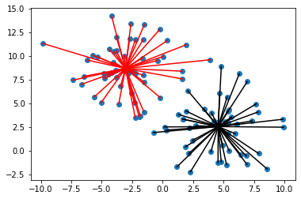
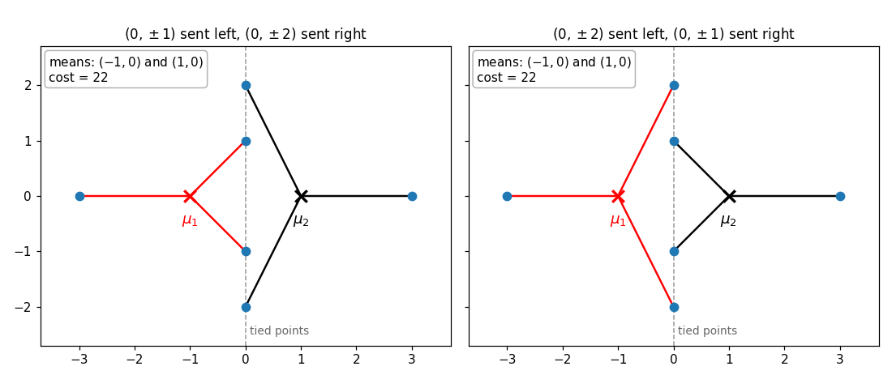
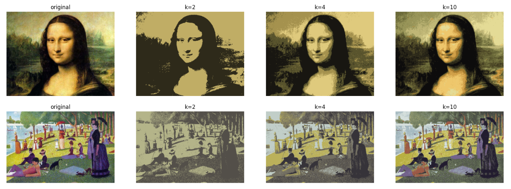

These notes complement the first lecture and the [K-means practical](https://github.com/mlelarge/ens-ml4sd/blob/main/notebooks/1_K_Means_empty.ipynb). They are meant for students who want to understand *why* the algorithm behaves as observed in the practical: why it always stops, why its output depends on the initialization and what scikit-learn does about it, why it fails on the two-moons dataset, and why we settle for a heuristic in the first place.

## 1. The cost function

We are given $n$ observations $x_1, \dots, x_n \in \mathbb{R}^d$ and a number of clusters $K$. A clustering is a partition $\mathcal{C} = (C_1, \dots, C_K)$ of the index set $\lbrace 1, \dots, n \rbrace$ into $K$ groups. Given a partition and centers $\mu = (\mu_1, \dots, \mu_K)$ in $\mathbb{R}^d$, the K-means cost is

$$
R(\mathcal{C}, \mu) = \sum_{k=1}^K \sum_{i \in C_k} \|x_i - \mu_k\|^2 .
$$

In words, the cost is the total squared distance between every point and the center of its assigned cluster; lower cost means tighter, more coherent clusters. In the figure below, the cost is the sum of the squared lengths of all the segments.

The cost of a partition alone is the cost obtained with the best possible centers for that partition,

$$
R(\mathcal{C}) = \min_{\mu} R(\mathcal{C}, \mu) .
$$

We prove in Section 3 that the best center of a cluster is its mean, $\mu_k = \frac{1}{\lvert C_k \rvert} \sum_{i \in C_k} x_i$, which is the definition used in the practical. The **K-means problem** is to find the partition $\mathcal{C}$ minimizing $R(\mathcal{C})$.

## 2. k-means algorithm

The algorithm implemented in the practical is the following.

1. **Initialize** the centers $\mu_1, \dots, \mu_K$, for instance by picking $K$ data points at random.
2. **Repeat** until the assignments no longer change:
   - **(a) Assignment step.** Assign each point to its nearest center: point $i$ goes to the cluster $k$ minimizing $\lVert x_i - \mu_k \rVert$. If a point is exactly equidistant from its current center and another one, it stays where it is.
   - **(b) Update step.** Move each center to the mean of its cluster: $\mu_k = \frac{1}{\lvert C_k \rvert} \sum_{i \in C_k} x_i$.

> Intuition: each point should belong to the cluster whose center is closest, and the arithmetic mean is the point that minimizes the sum of squared distances within a cluster (Lemma 1 below). The algorithm alternates between these two "obvious" improvements.

 One practical detail: a cluster may become empty during step (a), in which case its mean is undefined. Implementations either drop the cluster or re-seed it; scikit-learn moves the center of an empty cluster to the data point that is currently farthest from its own center.

## 3. Why the algorithm stops

The two steps of the k-means algorithm are the two *coordinate-wise* minimizations of the cost $R(\mathcal{C}, \mu)$: step (a) minimizes over the partition $\mathcal{C}$ with the centers fixed, and step (b) minimizes over the centers $\mu$ with the partition fixed. Let us check both claims.

**Lemma 1 (the mean minimizes the sum of squared distances).** Let $C$ be a finite set of indices with mean $\bar x = \frac{1}{\lvert C \rvert} \sum_{i \in C} x_i$. For every $\mu \in \mathbb{R}^d$,

$$
\sum_{i \in C} \|x_i - \mu\|^2 = \sum_{i \in C} \|x_i - \bar x\|^2 + |C| \, \|\bar x - \mu\|^2 .
$$

*Proof.* Write $x_i - \mu = (x_i - \bar x) + (\bar x - \mu)$ and expand the square:

$$
\sum_{i \in C} \|x_i - \mu\|^2 = \sum_{i \in C} \|x_i - \bar x\|^2 + 2 \Big\langle \sum_{i \in C} (x_i - \bar x), \, \bar x - \mu \Big\rangle + |C| \, \|\bar x - \mu\|^2 ,
$$

and the middle term vanishes because $\sum_{i \in C} (x_i - \bar x) = 0$ by definition of the mean. $\square$

The right-hand side is minimized exactly when $\mu = \bar x$: the mean is the *unique* minimizer, and no calculus is needed. In particular, step (b) never increases the cost, and strictly decreases it as soon as one center actually moves. Applying the lemma to each cluster also identifies the cost of a partition as its total within-cluster scatter,

$$
R(\mathcal{C}) = \sum_{k=1}^K \sum_{i \in C_k} \|x_i - \bar x_k\|^2 ,
$$

where $\bar x_k$ is the mean of $C_k$. Dividing by $n$, this is the average (weighted by cluster size) of the within-cluster variances: K-means looks for the partition with the smallest within-cluster variance. Finally, the identity is the familiar decomposition of a mean squared error into a variance term plus a squared bias term: the average squared distance from the points of a cluster to an arbitrary point $\mu$ equals the variance of the cluster plus the squared distance between $\mu$ and the mean.

**Lemma 2 (nearest-center assignment).** Fix the centers $\mu$ and write $c(i)$ for the cluster of point $i$, so that

$$
R(\mathcal{C}, \mu) = \sum_{i=1}^n \|x_i - \mu_{c(i)}\|^2 .
$$

Each term of this sum depends on the assignment of one point only, and is minimized by sending that point to its nearest center. Hence step (a) never increases the cost, and strictly decreases it as soon as one point moves to a strictly closer center.

**Theorem (finite termination).** The cost never increases along the iterations of the k-means algorithm, and the algorithm stops after a finite number of iterations. At that point, every center is the mean of its cluster and every point is assigned to its nearest center.

*Proof.* For $t \ge 1$, let $\mathcal{C}^{(t)}$ be the partition computed by step (a) of iteration $t$, and $\mu^{(t)}$ the centers computed by step (b) of iteration $t$, that is, the means of $\mathcal{C}^{(t)}$. Iteration $t+1$ computes $\mathcal{C}^{(t+1)}$ from $\mu^{(t)}$ by step (a), then $\mu^{(t+1)}$ from $\mathcal{C}^{(t+1)}$ by step (b), and the two lemmas give

$$
R(\mathcal{C}^{(t+1)}, \mu^{(t+1)}) \le R(\mathcal{C}^{(t+1)}, \mu^{(t)}) \le R(\mathcal{C}^{(t)}, \mu^{(t)}) .
$$

If the partition changes at iteration $t+1$, some point has moved, and by our tie-breaking rule it moved only because it was *strictly* closer to its new center, so the second inequality is strict. Therefore the cost strictly decreases at every iteration that changes the partition, and no partition can be visited twice. There are at most $K^n$ partitions, so after at most $K^n$ iterations the partition stops changing, and then the centers stop changing too. $\square$

Three remarks.

- The theorem says nothing about the *quality* of the final partition. A fixed point of the algorithm is only "locally optimal" in the weak sense that neither step can improve it; Section 4 shows that it can be far from the global minimum.
- The tie-breaking rule is essential to the proof. Without it, a point exactly equidistant from two centers may jump back and forth at no cost, and the algorithm can cycle. The figure below shows an example with $K = 2$ and six points: $(-3, 0)$, $(3, 0)$, and the four points $(0, \pm 1)$, $(0, \pm 2)$ on the vertical axis. With centers $\mu_1 = (-1, 0)$ and $\mu_2 = (1, 0)$, the four points on the vertical axis are tied. If the assignment step sends $(0, \pm 1)$ to the left cluster and $(0, \pm 2)$ to the right one (left panel), the means of the two clusters are again $(-1, 0)$ and $(1, 0)$, and the same holds if it sends them the other way (right panel). Without the rule, the assignments can therefore alternate between the two panels forever, while the centers and the cost never change, and the algorithm never stops. This is the only kind of cycle that can occur: along a cycle the cost is constant, so by Lemma 1 the centers are fixed, and only the partition can alternate between tied assignments. For data in general position (for example, drawn from a continuous distribution), exact ties have probability zero, so the rule never actually kicks in.

  

- The bound $K^n$ on the number of iterations is astronomically pessimistic. A finer count uses the fact that every partition produced by step (a) is a *Voronoi partition* (Section 5) of the data by $K$ centers, and that there are only $O(n^{Kd})$ such partitions (Inaba, Katoh and Imai, 1994). In practice, a few dozen iterations are typical; Section 6 says more about the worst case.

## 4. Local minima and the role of the initialization

Question 7 of the practical asks you to vary the random seed on the three-Gaussians example and to observe what happens. With bad luck, two of the three initial centers land in the same true cluster. The algorithm may then converge to a partition that splits this cluster in two and merges the other two under a single center sitting between them. Nothing in the k-means algorithm can repair this: both steps are already optimal given the other, so the algorithm has converged to a *local* minimum, whose cost may be several times the optimal one.

Two remedies are standard, and both are built into scikit-learn's `KMeans`.

**Restarts (`n_init`).** Run the algorithm from several independent initializations and keep the run with the smallest final cost. This is possible because the cost is cheap to evaluate.

**Careful seeding: k-means++ (`init='k-means++'`, the default).** Rather than picking the initial centers uniformly at random, Arthur and Vassilvitskii (2007) proposed to spread them out:

1. Choose the first center $\mu_1$ uniformly at random among the data points.
2. For $k = 2, \dots, K$: let $D(x_i) = \min_{\ell \lt k} \lVert x_i - \mu_\ell \rVert$ be the distance from $x_i$ to the nearest center already chosen, and pick the next center $\mu_k = x_i$ with probability proportional to $D(x_i)^2$.
3. Run the k-means algorithm from these $K$ centers.

Points far from the current centers are more likely to be chosen, so a cluster that has no center yet is likely to receive one at the next draw. Squaring the distances is a compromise between uniform sampling, which ignores the geometry, and always choosing the farthest point, which deterministically picks outliers. The remarkable fact is that this seeding comes with a guarantee valid for *any* dataset:

$$
\mathbb{E}\big[ R \big] \le 8 (\ln K + 2) \, R^\star ,
$$

where $R$ is the cost of the partition induced by the $K$ chosen centers, before any k-means iteration (which can only lower it), and $R^\star$ is the global minimum of the cost. 

Two implementation details explain the results of Question 9. scikit-learn uses a *greedy* variant of k-means++ that draws $2 + \lfloor \ln K \rfloor$ candidates at each step and keeps the one that decreases the cost the most. And its default `n_init='auto'` (since version 1.4) performs a single k-means++ run, or ten runs with `init='random'`; the practical used `n_init=10` explicitly. Combining careful seeding with ten restarts is why the failures observed with our uniformly initialized `kmeans_numpy` disappear with `KMeans`.

## 5. The geometry of K-means: why the two moons fail

Restarts fix *optimization* failures. The two-moons dataset of Questions 10 and 11 exhibits a different, deeper failure that no initialization can fix.

Fix the centers $\mu_1, \dots, \mu_K$. Step (a) assigns each point to its nearest center, that is, it cuts $\mathbb{R}^d$ into the *Voronoi cells*

$$
V_k = \lbrace x \in \mathbb{R}^d : \|x - \mu_k\| \le \|x - \mu_\ell\| \text{ for all } \ell \rbrace .
$$

Each inequality $\lVert x - \mu_k \rVert^2 \le \lVert x - \mu_\ell \rVert^2$ is, after expanding the squares, *linear* in $x$:

$$
2 \, \langle x, \mu_\ell - \mu_k \rangle \le \|\mu_\ell\|^2 - \|\mu_k\|^2 ,
$$

because the $\lVert x \rVert^2$ terms cancel. Geometrically, the boundary between the two cells is the hyperplane bisecting the segment joining $\mu_k$ and $\mu_\ell$. A Voronoi cell is therefore an intersection of $K - 1$ half-spaces, that is, a *convex polyhedron*, and this has two consequences for the clusters that K-means can produce.

- Any two clusters are separated by a hyperplane: the cluster of $\mu_k$ lies on one side of the bisector of $\mu_k$ and $\mu_\ell$, the cluster of $\mu_\ell$ on the other side. K-means can only output *pairwise linearly separable* clusters, each contained in a convex region.
- The cost is isotropic, it penalizes spread in every direction equally, so K-means implicitly assumes roughly spherical clusters of comparable spread. An elongated cluster is typically cut into pieces, and a small cluster next to a large one tends to be absorbed.

Each moon is non-convex and the two moons interleave, so no straight line separates them. Whatever the initialization, the two Voronoi cells of the final centers cut straight across the moons, which is what Question 11 shows. The partition returned by K-means is not a bad local minimum: the *global* minimum of the K-means cost is wrong too. The cost function, not the optimizer, is the problem.

The remedy is to change the representation of the data rather than the algorithm.

**Kernel K-means.** Map the points to a feature space, $x \mapsto \phi(x)$, in which the clusters become linearly separable, and run K-means there. This can be done without ever computing $\phi$: the squared distance from $\phi(x_i)$ to the mean $\bar\phi_k$ of cluster $k$ only involves inner products $\kappa(x, y) = \langle \phi(x), \phi(y) \rangle$,

$$
\|\phi(x_i) - \bar\phi_k\|^2 = \kappa(x_i, x_i) - \frac{2}{|C_k|} \sum_{j \in C_k} \kappa(x_i, x_j) + \frac{1}{|C_k|^2} \sum_{j, l \in C_k} \kappa(x_j, x_l) .
$$

This is the *kernel trick*, a recurring idea in machine learning.

**Spectral clustering.** Build a nearest-neighbor graph on the data, use the first eigenvectors of its Laplacian matrix as new coordinates for the points, and run K-means on these coordinates (`SpectralClustering(affinity='nearest_neighbors')` in scikit-learn). The two moons are the textbook example where this succeeds. Von Luxburg (2007) is an accessible tutorial, and Dhillon, Guan and Kulis (2004) show that spectral clustering is itself a kernel K-means in disguise.

**Methods based on connectivity rather than on centers,** such as single-linkage hierarchical clustering or DBSCAN, follow the shape of the moons directly.

The lesson goes beyond clustering: a simple algorithm applied to the right representation beats a clever algorithm applied to the wrong one. The second part of Practical 1, on the SVD, is precisely about representations.

## 6. Why a heuristic? The hardness of the K-means problem

It is worth separating the K-means *problem* (find the partition minimizing $R(\mathcal{C})$) from k-means *algorithm*, which is a heuristic for it. Why not solve the problem exactly?

**Brute force is hopeless.** The number of partitions of $n$ points into $K$ non-empty clusters is the Stirling number $S(n, K) \approx K^n / K!$; for the $n = 300$ points and $K = 3$ clusters of the practical, this is about $10^{142}$. Restricting the search to partitions that can be optimal helps in theory: an optimal partition is necessarily a Voronoi partition of its own means (otherwise step (a) would improve it), and Inaba, Katoh and Imai (1994) showed that $n$ points in $\mathbb{R}^d$ admit only $O(n^{Kd})$ Voronoi partitions by $K$ centers, which can be enumerated in $O(n^{Kd+1})$ time. This is polynomial when $K$ and $d$ are fixed, but useless in practice: for $n = 300$, $K = 3$ and $d = 2$, it already amounts to about $2 \cdot 10^{17}$ operations.

**The problem is NP-hard.** As soon as $K$ or $d$ is allowed to grow, no exact polynomial-time algorithm is known, and none is expected: minimizing the K-means cost is NP-hard already for $K = 2$ clusters in general dimension (Dasgupta, 2008; Aloise, Deshpande, Hansen and Popat, 2009), and already in the plane $d = 2$ for a general number of clusters (Mahajan, Nimbhorkar and Varadarajan, 2012). Unless P = NP, we have to settle for approximate solutions, and the k-means algorithm is the simplest one: a *local search* that moves between neighboring configurations as long as the cost decreases.

**How fast is the k-means algorithm?** Each iteration costs $O(nKd)$ operations (all point-to-center distances), so the question is the number of iterations. The count of Voronoi partitions gives the upper bound $O(n^{Kd})$, polynomial for fixed $K$ and $d$, and in practice the algorithm stops after a few dozen iterations. Yet the worst case is bad: Vattani (2011) constructed planar datasets (with $K$ growing with $n$) on which the k-means algorithm needs $2^{\Omega(n)}$ iterations. The gap between the worst case and practice is explained by *smoothed analysis*: Arthur, Manthey and Röglin (2011) proved that if every data point is perturbed by a small Gaussian noise of standard deviation $\sigma$, the expected number of iterations is bounded by a polynomial in $n$ and $1/\sigma$. Pathological instances exist, but they are fragile.

## 7. Example: image quantization

In an image, the color of a pixel is a vector $(R, G, B) \in \mathbb{R}^3$. Running K-means on the set of all pixel colors and replacing each pixel by the center of its cluster produces an image drawn with only $K$ colors, and the K-means cost is exactly the total squared distortion between the original and the quantized image. The examples below (Leonardo's *Mona Lisa* and Seurat's *A Sunday on La Grande Jatte*) use $K = 2$, $4$ and $10$ colors. This is the quantization task of Question 12 of the practical, applied there to the galaxy NGC 4414.

The k-means algorithm is also called Lloyd's algorithm, after Stuart Lloyd, whose original motivation (in a 1957 Bell Labs report, published only in 1982) was precisely this problem: quantizing a signal with the smallest squared error, so that the centers form the best "codebook" of size $K$.

## References

- D. Aloise, A. Deshpande, P. Hansen and P. Popat (2009). NP-hardness of Euclidean sum-of-squares clustering. *Machine Learning*, 75(2):245–248.
- D. Arthur and S. Vassilvitskii (2007). k-means++: the advantages of careful seeding. *Proceedings of the ACM-SIAM Symposium on Discrete Algorithms (SODA)*, 1027–1035.
- D. Arthur, B. Manthey and H. Röglin (2011). Smoothed analysis of the k-means method. *Journal of the ACM*, 58(5), article 19.
- S. Dasgupta (2008). The hardness of k-means clustering. Technical Report CS2008-0916, University of California, San Diego.
- I. S. Dhillon, Y. Guan and B. Kulis (2004). Kernel k-means, spectral clustering and normalized cuts. *Proceedings of KDD*, 551–556.
- M. Inaba, N. Katoh and H. Imai (1994). Applications of weighted Voronoi diagrams and randomization to variance-based k-clustering. *Proceedings of the ACM Symposium on Computational Geometry*, 332–339.
- T. Kanungo, D. M. Mount, N. S. Netanyahu, C. D. Piatko, R. Silverman and A. Y. Wu (2004). A local search approximation algorithm for k-means clustering. *Computational Geometry*, 28(2–3):89–112.
- S. P. Lloyd (1982). Least squares quantization in PCM. *IEEE Transactions on Information Theory*, 28(2):129–137. (Bell Labs technical report, 1957.)
- J. MacQueen (1967). Some methods for classification and analysis of multivariate observations. *Proceedings of the Fifth Berkeley Symposium on Mathematical Statistics and Probability*, vol. 1, 281–297.
- M. Mahajan, P. Nimbhorkar and K. Varadarajan (2012). The planar k-means problem is NP-hard. *Theoretical Computer Science*, 442:13–21.
- U. von Luxburg (2007). A tutorial on spectral clustering. *Statistics and Computing*, 17(4):395–416.
- A. Vattani (2011). k-means requires exponentially many iterations even in the plane. *Discrete & Computational Geometry*, 45(4):596–616.
