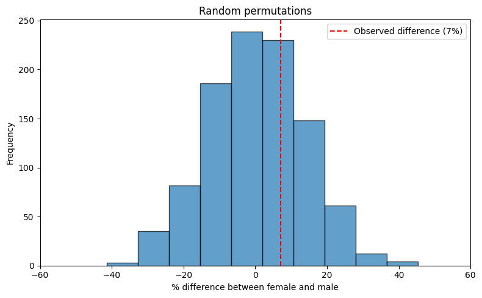
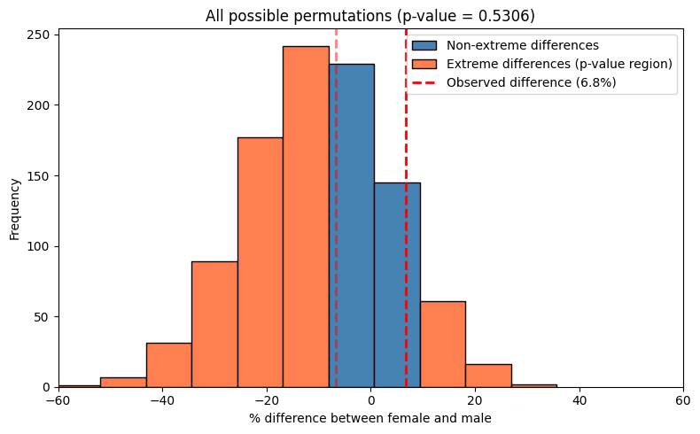

# 2. Testing Independence in Contingency Tables: The Chi-Square Test

## Introduction

This example examines the relationship between gender and arm-crossing preference (which arm goes on top when crossing arms). The data comes from a class survey of 54 students (source: Chapter 10 of [The Art of Statistics](https://www.penguin.co.uk/books/294857/the-art-of-statistics-by-spiegelhalter-david/9780241258767) by David Spiegelhalter):
- 14 females and 40 males
- 22 students cross their left arm on top
- 32 students cross their right arm on top

The "fundamental" question: **Is arm-crossing preference independent of gender, or is there an association between these variables?**

## The Data: A 2×2 Contingency Table

|           | Left arm on top | Right arm on top | Total |
|-----------|-----------------|------------------|-------|
| Female    | 5               | 9                | 14    |
| Male      | 17              | 23               | 40    |
| Total     | 22              | 32               | 54    |

**Observed proportions:**
- Total population crossing right arm on top: 32/54 = 59%
- Females crossing right arm on top: 9/14 = 64.3%
- Males crossing right arm on top: 23/40 = 57.5%
- Difference in proportions: 64.3% - 57.5% = 6.8 percentage points

## Null Hypothesis

**H₀:** Gender and arm-crossing preference are independent. 

Under this hypothesis, the probability that someone crosses their right arm on top is the same regardless of gender.
Is the observed difference of 6.8 % big enough to provide evidence against the null hypothesis?

## Approach 1: Permutation Test (Randomization)

### Concept

If gender and arm-crossing are truly independent, we could randomly shuffle who has which arm-crossing preference while keeping the gender composition fixed, and the resulting distribution would show us what differences we'd expect by chance.

### Procedure

1. Keep the gender labels fixed (14 females, 40 males)
2. Keep the total counts fixed (22 left-arm crossers, 32 right-arm crossers)
3. Randomly assign arm-crossing behaviors to individuals
4. Calculate the proportion difference for each random assignment
5. Repeat many times (e.g., 1,000 iterations) to build a **null distribution**

### Interpretation

The resulting distribution shows all possible differences that could occur purely by chance under the null hypothesis. We compare our observed difference (6.8% $\approx$ 7%) to this distribution. If the observed difference is common in the randomization distribution, it's consistent with chance. If it's rare, we have evidence against independence.

## Approach 2: Hypergeometric Distribution (Exact Permutations)

### The "Balls in Urns" Analogy

Instead of randomly sampling permutations, we can calculate the **exact probability** of all possible outcomes:

- Imagine 54 balls: 14 white (females) and 40 black (males)
- Randomly draw 32 balls without replacement (representing the 32 people who cross right arm on top)
- Question: How many of the 32 drawn balls will be white?

### Mathematical Framework

Under the null hypothesis of independence, the number of females crossing their right arm on top follows a **hypergeometric distribution**:

$$P(X = k) = \frac{{14 \choose k}{40 \choose 32-k}}{{54 \choose 32}}$$

where:
- X = number of females crossing right arm on top
- k ranges from 0 to 14
- The formula counts all ways to select k females and (32-k) males from the population

### Two-sided Test

To test if the observed pattern (a difference of 6.8% in proportions) is unlikely under the null hypothesis, we need to define what "as extreme or more extreme" means in either direction.

The most principled approach measures extremeness by the **absolute difference in proportions**. Here the observed difference is |64.3% - 57.5%| = 6.8%

The two-sided p-value is the sum of probabilities for all outcomes with absolute difference ≥ 6.8%:

$$P(\text{two-sided}) = \sum_{k: |d(k)| \geq |d_{\text{obs}}|} P(X = k)$$

where:
- $d(k) = \frac{k}{14} - \frac{32-k}{40}$ is the difference in proportions when k females cross right arm on top
- $d_{\text{obs}} = \frac{9}{14} - \frac{23}{40}$ is the observed difference
- $P(X = k) = \frac{{14 \choose k}{40 \choose 32-k}}{{54 \choose 32}}$ is the hypergeometric probability

## Approach 3: Chi-Square Test

### The Chi-Square Statistic

The chi-square test is the most commonly used method for testing independence in contingency tables. The test statistic quantifies how much the **observed data** differs from what we'd **expect if there was no association**.

### Mathematical Formula

$$\chi^2 = \sum_{\text{all cells}} \frac{(\text{Observed} - \text{Expected})^2}{\text{Expected}}$$

### Calculation Steps

1. **Calculate expected frequencies** under the null hypothesis of independence:

$$E_{ij} = \frac{(\text{row } i \text{ total}) \times (\text{column } j \text{ total})}{\text{grand total}}$$

For our example:
- Expected females crossing right arm on top: (14 × 32) / 54 = 8.296
- Expected females crossing left arm on top: (14 × 22) / 54 = 5.704
- Expected males crossing right arm on top: (40 × 32) / 54 = 23.704
- Expected males crossing left arm on top: (40 × 22) / 54 = 16.296

2. **Calculate the chi-square statistic** by summing contributions from all cells:

| Cell | Observed (O) | Expected (E) | (O - E)² / E |
|------|--------------|--------------|--------------|
| Female, Right | 9 | 8.296 | 0.0597 |
| Female, Left | 5 | 5.704 | 0.0868 |
| Male, Right | 23 | 23.704 | 0.0209 |
| Male, Left | 17 | 16.296 | 0.0304 |

$$\chi^2 = 0.0597 + 0.0868 + 0.0209 + 0.0304 = 0.1978$$

### Interpretation

- **Small χ²**: Observed data close to expected → little evidence against independence
- **Large χ²**: Observed data far from expected → strong evidence of association
- The chi-square statistic follows a χ² distribution with degrees of freedom = (rows - 1) × (columns - 1) = 1

For our data, χ² = 0.1978 is quite small, suggesting the observed difference is consistent with chance.

## Important Consideration: Yates' Continuity Correction

### The Problem

The chi-square test approximates a discrete distribution (the actual data) with a continuous distribution (the χ² distribution). For small sample sizes or 2×2 tables, this can overestimate statistical significance.

### The Solution: Yates' Correction

Yates' continuity correction adjusts the chi-square formula to be more conservative:

$$\chi^2_{\text{Yates}} = \sum_{\text{all cells}} \frac{(|O - E| - 0.5)^2}{E}$$

The correction subtracts 0.5 from the absolute difference before squaring, reducing the chi-square statistic.

### When to Use It

- **Use correction**: For 2×2 tables, especially with small expected frequencies (< 5 in any cell)
- **Don't use correction**: For larger tables or when expected frequencies are all reasonably large

### Important Note on Software Defaults

**Be careful with default values in statistical software!** Many implementations (including SciPy's `chi2_contingency`) apply Yates' correction **by default** for 2×2 tables. You may need to explicitly disable it (`correction=False`) to get the uncorrected test.

